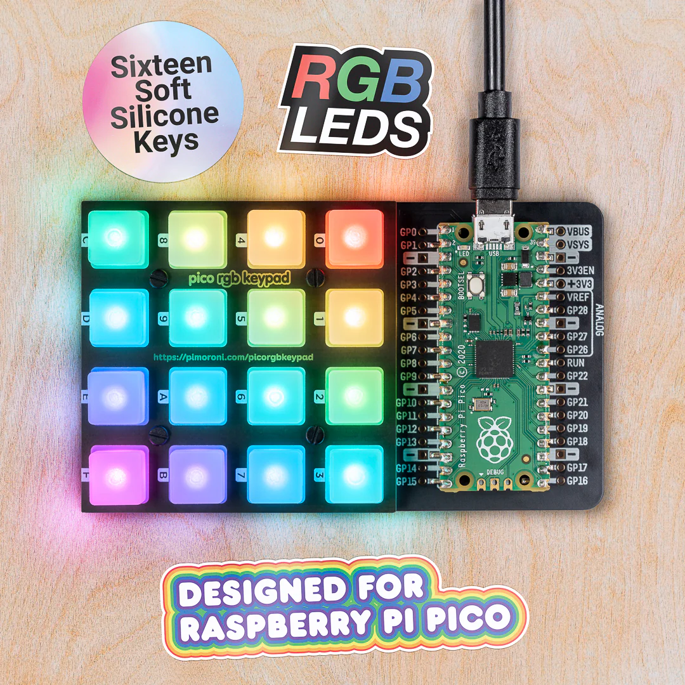

# Raspberry Pi Pico C++ Keypad

## 4x4 RGB LED Clock - Segmant Display

This project uses a 4x4 RGB LED grid to display the current time (hours and minuts) in a segmant-based format, similar to a digital clock.

The grid is divided into four quadrents, each representing a digit of the current hour and minute using 2x2 blocks of LEDs.

The clock updates every second to display the real-time.

### 1. **Grid Layout**
   - The 4x4 LED grid is divided into four 2x2 sections:
     - **Top-left quadrant**: Tens digit of the hour.
     - **Top-right quadrant**: Ones digit of the hour.
     - **Bottom-left quadrant**: Tens digit of the minute.
     - **Bottom-right quadrant**: Ones digit of the minute.
     
   Each section uses a simple 2x2 LED pattern to represnt digits 0-9.

### 2. **Digit Representation (2x2 Block)**
   Each digit (0-9) is represented by a unique patern within a 2x2 block of LEDs. For example:
   - `0` is a full square of LEDs.
   - `1` is a verticle line on the right side.
   - `2` is the top, right, and bottom sides of the block.
   
   These paterns can be customised or expanded as needed.

### 3. **RGB Color Scheme**
   - **Hours** are displayed in **red**.
   - **Minutes** are displayed in **blue**.
   
   This color distinction helps differentiate between the hours and minutes on the grid.

### 4. **Time Display Logic**
   - The current time is fetchted using Python’s `datetime` module.
   - The time is splited into four digits:
     - Tens and ones digits for hours (e.g., for 12:34, hours = `1`, `2`).
     - Tens and ones digits for minutes (e.g., for 12:34, minutes = `3`, `4`).
   - These digits are mapped to specific quadrants of the LED grid, where each digit is drawn using the corresponding 2x2 LED patern.
   
### 5. **Clock Update Loop**
   - The program runs in an infinite loop, updating the display every second to reflect the current time.
   - The `pixels.show()` method sends the updated patern to the LEDs, and the display refreshes continuosly.

## Code Summary

### 1. **Initialization**
   The `rpi_ws281x` or `adafruit-circuitpython-neopixel` library is used to controle the RGB LEDs. A grid of 16 LEDs is initialised with a brightness setting.

### 2. **Digit Drawing**
   The `draw_digit()` function is used to draw a specific digit on the 2x2 LED block by lighting up the corresponding LEDs according to the patern for each digit.

### 3. **Main Loop**
   - The current time is fetchted using `datetime.now()`
   - The four digits of hours and minuts are drawn on the LED grid using the `draw_digit()` function, with different colors for each.
   - The display is updated every second to keep showing the curent time.
